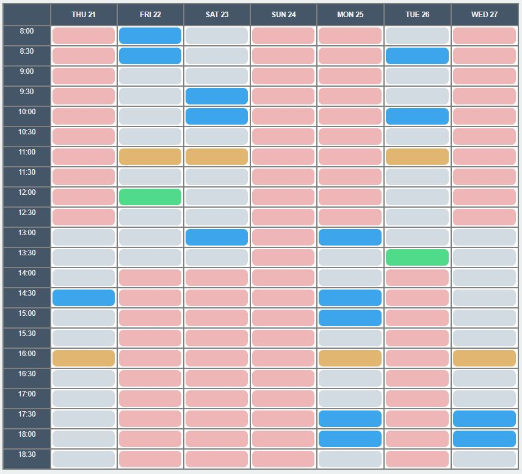

This project was bootstrapped with [Create React App](https://github.com/facebook/create-react-app).

## Steps to run:

### `npm install`

Installs dependencies needed to run the app

### `npm start`

Runs the app in the development mode.
Open (http://localhost:3000) to view it in the browser.

The page will reload if you make edits.
You will also see any lint errors in the console.

## Existing problems

1) Random appointments shown only after first refresh. Also, they are erased after second refresh 
because isTaken property of appointment is set to false after refresh.

2) Sometimes less than 15 appointments are shown because of duplicates. Can be fixed by shuffling 
the whole array of free appointments and taking first 15 of them.

3) After refreshing, user can again input 1 appointment a day and 2 per week even though
previous user appointments are still shown.

## Color coding

- red - sundays and odd saturdays
- blue - random generated appointments
- green - user generated appointments
- orange - rest break

